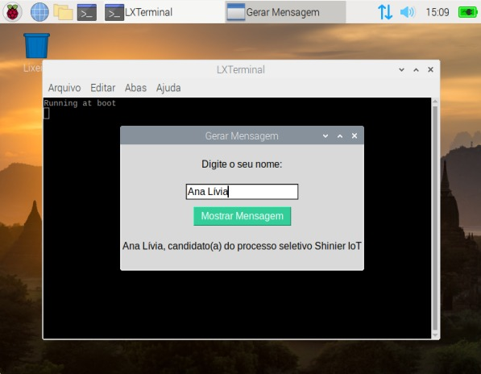

# psel-shinier-2023-iot

Desafio para processo seletivo Shinier 2023
Vaga de Desenvolvedor(a) IoT

## Funcionalidades em desenvolvimento

- O programa em Python baixa a versão mais recente de si mesmo de um repositório de controle de versão e atualiza-se regularmente.
- Este programa roda em um Raspberry Pi.
- O programa inicia automaticamente quando o Raspberry Pi é ligado.
- O programa possui uma interface de usuário simples onde o candidato pode inserir o seu nome e, ao clicar em um botão, a mensagem "candidato processo seletivo Shinier IoT" aparece.

 

## Pré-requisitos

- Python 3
- Raspberry Pi (alternativas de emuladores, como Docker ou Máquina Virtual, são suficientes)

### Máquina Virtual

- [VirtualBox](https://www.virtualbox.org/wiki/Downloads)
- [Imagem utilizada](https://downloads.raspberrypi.org/rpd_x86/images/)

## Bibliotecas

Instalação em Raspbian:

- GitPython

```
pip3 install git-python
```

- Schedule

```
pip3 install schedule
```

- Tkinter (interface gráfica)

```
sudo apt-get install python3-tk
```

## Configurando o Raspberry Pi

### Inicialização automática

O programa inicia automaticamente quando o Raspberry Pi é ligado e sempre que um noto terminal é aberto:

Editando o .bashrc

```
sudo nano /home/pi/.bashrc
```

Adicionar no final do arquivo
(Conferir a localização e nome do arquivo na máquina)

```
echo Running at boot 
sudo python3 /home/pi/main.py
```

Para testes:

```
sudo reboot
```
